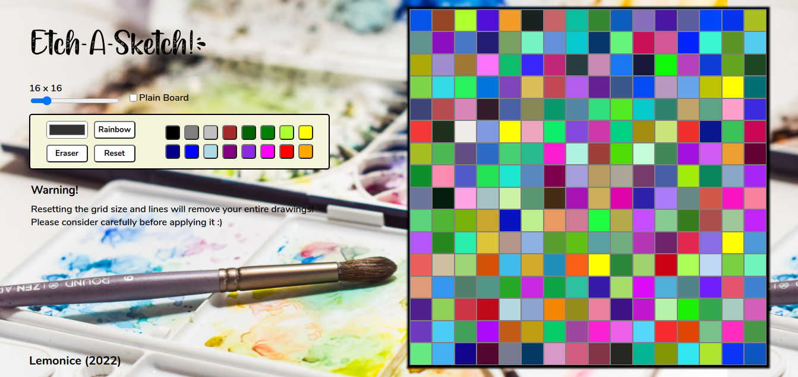

# Etch a Sketch!

[Click here](https://lemonice888.github.io/etch-a-sketch) for live preview!

It's a web version of sketchpad that allows you to draw a pixel-styled art.

## Technologies I Used
* HTML
* CSS
* JavaScript

## What I Learned
* How to dynamically modify the appearance of any elements using JavaScript, which I think is basically similar to CSS properties.
* How to make an internal element like div using JavaScript. In my project, I applied this concept to create the grid and line options in the sketch board.
* How to receive the input from HTML input attributes and attach it into a specific element or event. I used it to create the functionalities of the grid size and customable color options.
* And many more...

Background image by: [Sarah Brown](https://unsplash.com/photos/Yova_ho8NhU)
